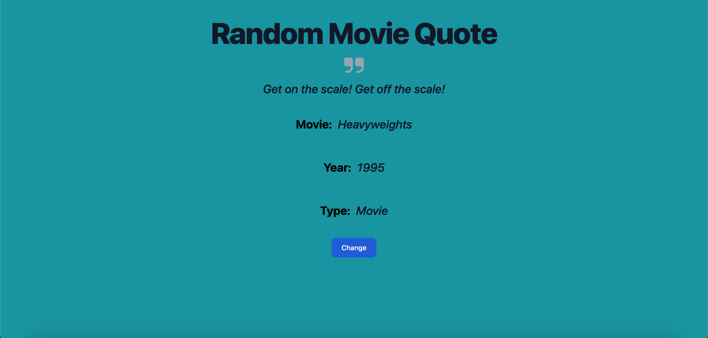

# Random-Message [](https://aaronerodriguez.github.io/Random-Message/)
This project will generate a <u>*random movie quote*</u> with just a press of a button.

The following <u>**npm module**</u> was used to generate the quote information:
>[popular-movie-quotes](https://www.npmjs.com/package/popular-movie-quotes?activeTab=readme)

## Installation

To install all you need to do is <u>fork</u> the repository, clone that forked repository and once you have cloned it. In the terminal, run:
```console 
npm i
```
in order to install the dependencies. Once that's done, you will have a copy of the project.
## Picutre:

The project will start with placeholder information for each area. Everytime the user presses the change button, the following will change:
- The quote
- The corresponding movie
- The corresponding year
- The corresponding type of media
- The background color

It'll display the corresponding information.